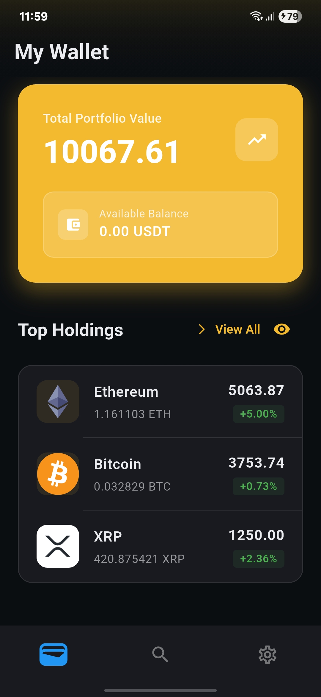
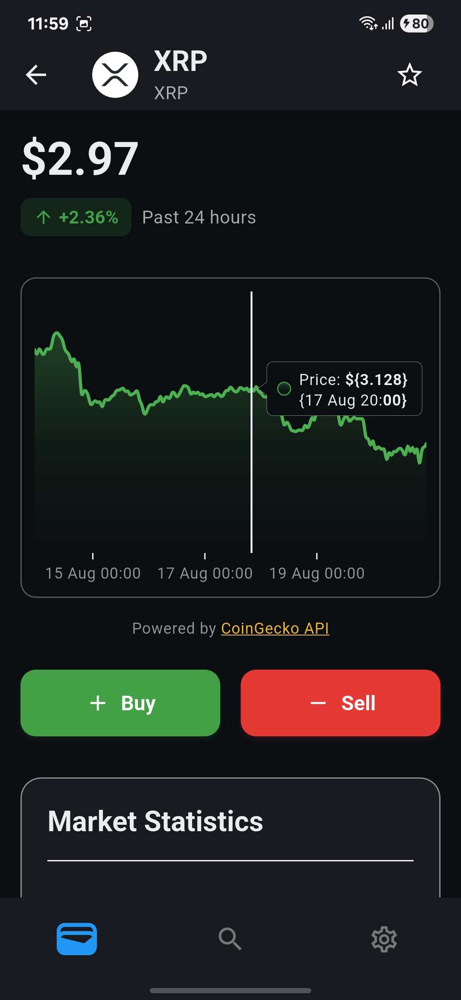
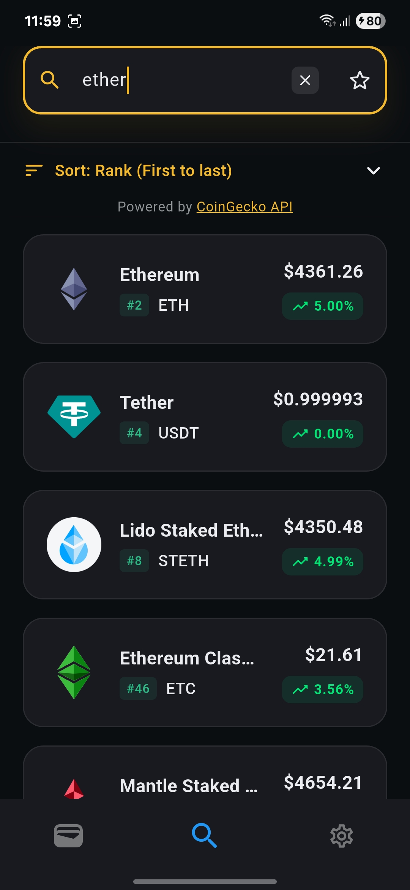
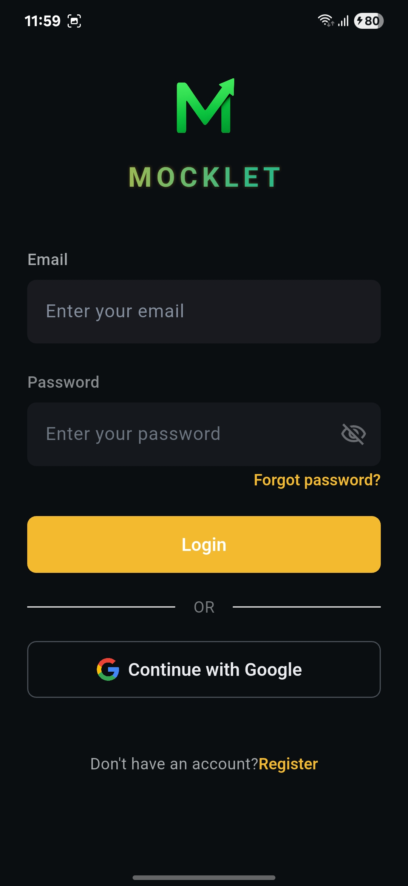

# 🪙 Mocklet

> _A comprehensive cryptocurrency tracking and portfolio management application built with Flutter_

Mocklet is a feature-rich mobile application that empowers users to track cryptocurrency markets, manage their digital portfolios, and stay informed about the latest trends in the crypto world. With real-time data integration, intuitive design, and robust security features, Mocklet provides everything you need for effective cryptocurrency management.

<div align="center">
  <a href="https://play.google.com/store/apps/details?id=com.ardakoksal.mocklet">
    
  </a>
</div>

---cklet

> _A comprehensive cryptocurrency tracking and portfolio management application built with Flutter_

Mocklet is a feature-rich mobile application that empowers users to track cryptocurrency markets, manage their digital portfolios, and stay informed about the latest trends in the crypto world. With real-time data integration, intuitive design, and robust security features, Mocklet provides everything you need for effective cryptocurrency management.

---

## ✨ Key Features

### 🔐 **Secure Authentication**

- Firebase Authentication integration
- Google Sign-In support
- Secure user data protection

### 📊 **Real-Time Market Data**

- Live cryptocurrency prices via CoinGecko API
- Comprehensive market statistics
- Historical price charts and analytics

### 💼 **Portfolio Management**

- Track your crypto holdings
- Monitor portfolio performance
- Detailed asset allocation insights

### 🔍 **Advanced Search**

- Quick cryptocurrency search
- Filter and sort capabilities
- Comprehensive coin information

### 🌍 **Multi-Language Support**

- Available in 6 languages (EN, DE, ES, FR, IT, TR)
- Easy localization with dynamic language switching
- Region-specific formatting

### 📱 **Modern UI/UX**

- Clean, intuitive interface
- Smooth animations and transitions
- Responsive design for all screen sizes

### 🔄 **Offline Capabilities**

- Local data caching with Hive
- Offline portfolio access
- Seamless online/offline synchronization

---

## 📱 Screenshots

<div align="center">
  <table>
    <tr>
      <td align="center">
        
        <br/><b>Dashboard</b>
      </td>
      <td align="center">
        
        <br/><b>Markets</b>
      </td>
      <td align="center">
        
        <br/><b>Portfolio</b>
      </td>
      <td align="center">
        
        <br/><b>Settings</b>
      </td>
    </tr>
  </table>
</div>

---

## 🚀 Quick Start

### Prerequisites

- Flutter SDK (3.8.1 or higher)
- Dart SDK
- Android Studio / VS Code
- Firebase project setup

### Installation

1. **Clone the repository**

   ```bash
   git clone https://github.com/ArdaKoksall/mocklet_source.git
   cd mocklet_source
   ```

2. **Install dependencies**

   ```bash
   flutter pub get
   ```

3. **Configure Firebase**

   - Add your `google-services.json` (Android) and `GoogleService-Info.plist` (iOS)
   - Update Firebase configuration as needed

4. **Run the application**

   ```bash
   # For development
   flutter run

   # For release build
   flutter build apk --release
   ```

---

## 🏗️ Architecture

The project follows clean architecture principles with a well-organized structure:

```
lib/
├── 📁 api/              # API services and endpoints
├── 📁 app/              # Core application logic
│   ├── core/            # Business logic (Brain)
│   ├── data/            # Constants and themes
│   └── service/         # App services (Hive, Preferences, Theme)
├── 📁 models/           # Data models and types
│   ├── cached/          # Cached data models
│   └── runtime/         # Runtime data models
├── 📁 screens/          # UI screens and components
│   ├── first/           # Authentication flow
│   └── second/          # Main application screens
└── 📄 main.dart         # Application entry point
```

---

## 🛠️ Technology Stack

### **Core Framework**

- **Flutter** - Cross-platform UI framework
- **Dart** - Programming language

### **State Management**

- **Riverpod** - Reactive state management

### **Backend & Authentication**

- **Firebase Core** - Backend platform
- **Firebase Auth** - User authentication
- **Firebase Analytics** - App analytics
- **Firebase Crashlytics** - Crash reporting

### **Data & Storage**

- **Hive** - Local NoSQL database
- **Shared Preferences** - Simple key-value storage
- **Dio** - HTTP client for API requests

### **UI & Experience**

- **Syncfusion Charts** - Professional charts and graphs
- **Flutter Animate** - Smooth animations
- **Cached Network Image** - Optimized image loading
- **Video Player** - Video content support

### **Localization & Utilities**

- **Easy Localization** - Multi-language support
- **Country Flags** - Flag displays
- **URL Launcher** - External link handling
- **Email Validator** - Input validation

### **Monetization**

- **Google Mobile Ads** - Advertisement integration

---

## 📊 Features Overview

| Feature               | Description               | Status      |
| --------------------- | ------------------------- | ----------- |
| 🔐 Authentication     | Firebase + Google Sign-In | ✅ Complete |
| 📈 Real-time Data     | CoinGecko API integration | ✅ Complete |
| 💼 Portfolio Tracking | Holdings management       | ✅ Complete |
| 📊 Charts & Analytics | Interactive price charts  | ✅ Complete |
| 🌍 Multi-language     | 6 languages supported     | ✅ Complete |
| 📱 Responsive Design  | All screen sizes          | ✅ Complete |
| 🔄 Offline Mode       | Local data caching        | ✅ Complete |
| 🎯 Ad Integration     | Google Mobile Ads         | ✅ Complete |

---

## 📄 License

This project is licensed under the **Apache License 2.0**. See the [LICENSE](LICENSE) file for details.

---

## 🙏 Acknowledgments

- **[CoinGecko](https://www.coingecko.com/)** - Comprehensive cryptocurrency API
- **[Firebase](https://firebase.google.com/)** - Backend infrastructure and services
- **[Flutter Community](https://flutter.dev/community)** - Amazing ecosystem and resources
- **[Syncfusion](https://www.syncfusion.com/)** - Professional chart components

---

<div align="center">
  <p>Made with ❤️ using Flutter</p>
  <p>⭐ Star this repository if you found it helpful!</p>
</div>
